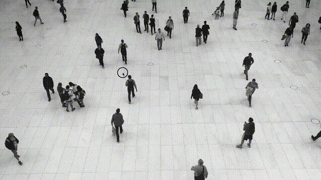

# ofxOpenCvTracker

## Description
ofxOpenCvTracker is a realtime object tracking addon for openframeworks.

Tracker sample is included opencv_contrib. I built opencv with contrib library and made it easier to use on Openframeworks. Here is a link to learn opencv tracking module. https://www.learnopencv.com/object-tracking-using-opencv-cpp-python/

## Usage
See Examples for more details

### camera example
Realtime tracking example on webcam video image by mouse operation.

## Install
### 1. Clone ofxOpenCvTracker to your of/addon directory
    $ git clone https://github.com/TetsuakiBaba/ofxOpenCvTracker.git
### 2. Download OpenCV.framework to ofxOpenCvTracker/libs directory. 
    $ curl -O https://tetsuakibaba.jp/tmp/opencv2.framework.arm64.zip
    $ unzip opencv2.framework.arm64.zip
   
Or you may build your own opencv2.framework from opencv source. ( https://tetsuakibaba.jp/ws/doku.php?id=opencv_dnn:opencv2.framework )

## Getting Started with Examples/camera
### 1. Update camera with the projectGenerator.
### 2. Run, nothing special. 

## Compatibility
- macOS(arm64)
- of version: 0.11.2

## Licence
- Source Code: [MIT](https://opensource.org/licenses/MIT)
- Video by Coverr from Pexels (https://www.pexels.com/video/black-and-white-video-of-people-853889/)

## Author
[TetsuakiBaba](https://github.com/TetsuakiBaba)

## Reference
1. opencv_contrib: https://github.com/opencv/opencv_contrib

